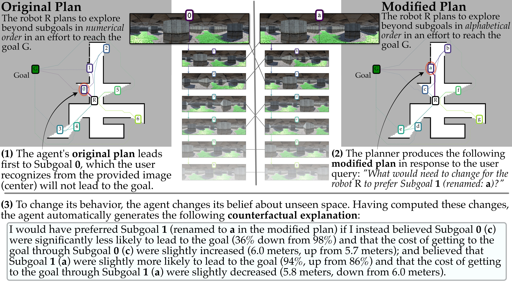

# LSP XAI: Generating High-Quality Explanations for Navigation in Partially-Revealed Environments

This work presents an approach to *explainable navigation under uncertainty*.

This is the code release associated with the NeurIPS 2021 paper *Generating High-Quality Explanations for Navigation in Partially-Revealed Environments*. In this repository, we provide all the code, data, and simulation environments necessary to reproduce our results. These results include (1) training, (2) large-scale evaluation, (3) explaining robot behavior, and (4) interveneing-via-explaining.

Gregory J. Stein. "Generating High-Quality Explanations for Navigation in Partially-Revealed Environments." In: Neural Information Processing Systems (NeurIPS). 2021. [paper](https://proceedings.neurips.cc/paper/2021/hash/926ec030f29f83ce5318754fdb631a33-Abstract.html), [video (13 min)](https://youtu.be/rWxHJJMEPFI), [blog post](https://cs.gmu.edu/~gjstein/2021/11/explainable-navigation-under-uncertainty/).

```bibtex
@inproceedings{stein2021xailsp,
  title = {Generating High-Quality Explanations for Navigation in Partially-Revealed Environments},
  author = {Gregory J. Stein},
  booktitle = {Advances in Neural Information Processing Systems (NeurIPS)},
  year = 2021,
  keywords = {explainability; planning under uncertainty; subgoal-based planning; interpretable-by-design},
}
```

Here we show an example of an explanation automatically generated by our approach in one of our simulated environments, in which the green path on the ground indicates a likely route to the goal:
<p align="center">
  
</p>

## Getting Started

We use Docker (with the Nvidia runtime) and GNU Make to run our code, so both are required to run our code. First, docker must be installed by following [the official docker install guide](https://docs.docker.com/engine/install/ubuntu/)
(the official docker install guide). Second, our docker environments will require that the NVIDIA docker runtime is installed (via `nvidia-container-toolkit`. Follow the install instructions on the [nvidia-docker GitHub page](https://github.com/NVIDIA/nvidia-docker#quickstart) to get it. See the top level readme for more instructions.

# Running Results Experiments

We also provide targets for re-running the results for each of our simulated experimental setups:

```bash
# Build the repo
make build

# Maze Environments
make lsp-xai-maze EXPERIMENT_NAME=base_allSG
make lsp-xai-maze EXPERIMENT_NAME=base_4SG SP_LIMIT_NUM=4
make lsp-xai-maze EXPERIMENT_NAME=base_0SG SP_LIMIT_NUM=0

# University Building (floorplan) Environments
make lsp-xai-floorplan EXPERIMENT_NAME=base_allSG
make lsp-xai-floorplan EXPERIMENT_NAME=base_4SG SP_LIMIT_NUM=4
make lsp-xai-floorplan EXPERIMENT_NAME=base_0SG SP_LIMIT_NUM=0

# Results Plotting
make lsp-xai-process-results
```

The make commands above can be augmented to run the trials in parallel, by adding `-jN` (where `N` is the number of trials to be run in parallel) to each of the Make commands. On our NVIDIA 2060 SUPER, we are limited by GPU RAM, and so we limit to `N=4`. Running with higher N is *possible* but sometimes our simulator tries to allocate memory that does not exist and will crash, requiring that the trial be rerun. It is in principle possible to also generate data and train the learned planners from scratch, though (for now) this part of the pipeline has not been as extensively tested; data generation consumes roughly 1.5TB of disk space, so be sure to have that space available if you wish to run that part of the pipeline. Even with 4 parallel trials, we estimate that running all the above code from scratch (including data generation, training, and evaluation) will take roughly 2 weeks, half of which is evaluation.

## Generating Explanations
	
We have provided a make target that generates two explanations that correspond to those included in the paper. Running the following make targets in a command prompt will generate these:

```bash
# Build the repo
make build
# Generate explanation plots
make lsp-xai-explanations
```

For each, the planner is run for a set number of steps and an explanation is generated by the agent and its learned model to justify its behavior compared to what the oracle planner specifies as the action known to lead to the unseen goal. A plot will be generated for each of the explanations and added to `./data/explanations`.

# Code Organization

The `src` folder contains a number of python packages necessary for this paper. Most of the *algorithmic* code that reflects our primary *research* contributions is predominantly spread across three files:

- `lsp_xai.planners.subgoal_planner` The `SubgoalPlanner` class is the one which encapsulates much of the logic for deciding where the robot should go including its calculation of which action it should take and what is the "next best" action. This class is the primary means by which the agent collects information and dispatches it elsewhere to make decisions.
- `lsp_xai.learning.models.exp_nav_vis_lsp` The `ExpVisNavLSP` defines the neural network along with its loss terms used to train it. Also critical are the functions included in this and the `xai.utils.data` file for "updating" the policies to reflect the newly estimated subgoal properties even after the network has been retrained. This class also includes the functionality for computing the delta subgoal properties that primarily define our counterfactual explanations. Virtuall all of this functionality heavily leverages PyTorch, which makes it easy to compute the gradients of the expected cost for each of the policies.
- `lsp_xai.planners.explanation` This file defines the `Explanation` class that stores the subgoal properties and their deltas (computed via `ExpVisNavLSP`) and composes these into a natural language explanation and a helpful visualization showing all the information necessary to understand the agent's decision-making process.
